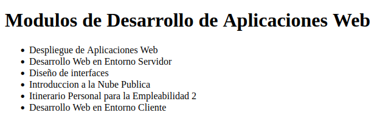

# dawAct1_3

## Contenido de la página

La página web contiene un listado con varios **módulos** del curso de DAW.

### Ejemplo

Aquí tenemos un _ejemplo_ de cómo es la página sin estilos:

Como se puede apreciar, la **lista** mustra varios módulos como:

- Despliegue de Aplicaciones Web
- Diseño de Interfaces
- Desarrollo Web
  1. En Entorno Cliente
  2. En Entorno Servidor

## Información extra

### Todos los módulos

La lista completa de módulos puede ser encontrada [aquí](https://ceice.gva.es/es/web/formacion-profesional/publicador-de-cicles/-/asset_publisher/M0SqOt5YOf05/content/ciclo-formativo-desarrollo-de-aplicaciones-web)

### Añadir más módulos a la página

En caso de querer añadir más módulos al listado se podría hacer añadiendo un `<li>` dentro de la `<ul>` que hay en el archivo index.html. Ejemplo:

```
<ul>
    ...
    <li>Sostenibilidad aplicada al Sistema Productivo</li>
</ul>
```
